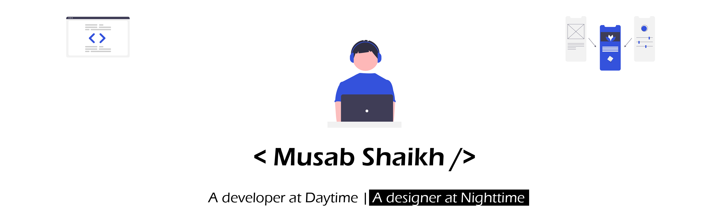

  

### Musab Shaikh

An eager lerner and passionate web developer. Building a user friendly experience with customized designs is what i always aim for.

### Skills and experience

* C/C++
* HTML, CSS, JS
* React
* MongoDb
* Firebase
* Nodejs
* Figma
* Adobe apps

<!--
**MusabShk/MusabShk** is a ✨ _special_ ✨ repository because its `README.md` (this file) appears on your GitHub profile.

Here are some ideas to get you started:

- 🔭 I’m currently working on ...
- 🌱 I’m currently learning ...
- 👯 I’m looking to collaborate on ...
- 🤔 I’m looking for help with ...
- 💬 Ask me about ...
- 📫 How to reach me: ...
- 😄 Pronouns: ...
- ⚡ Fun fact: ...
-->
